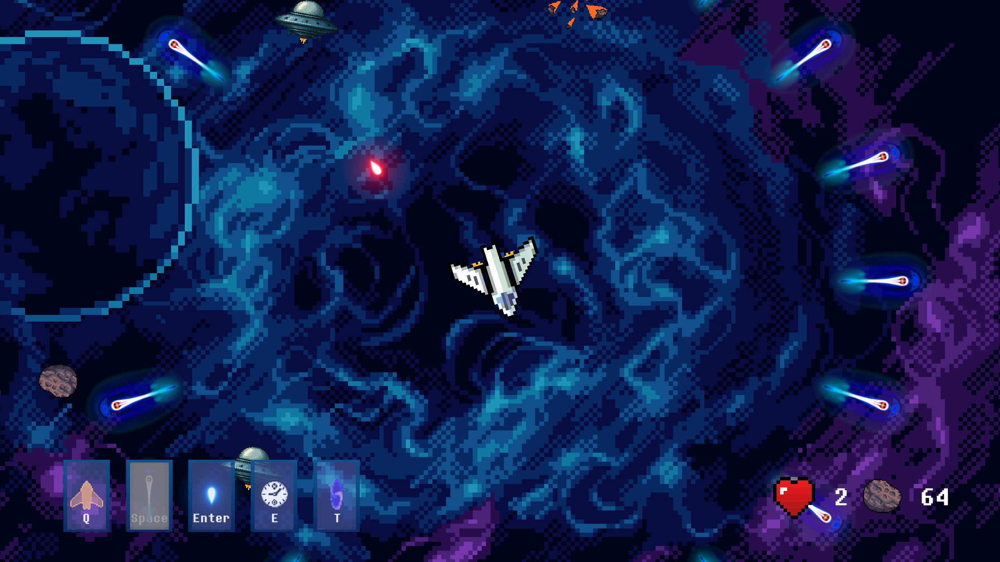
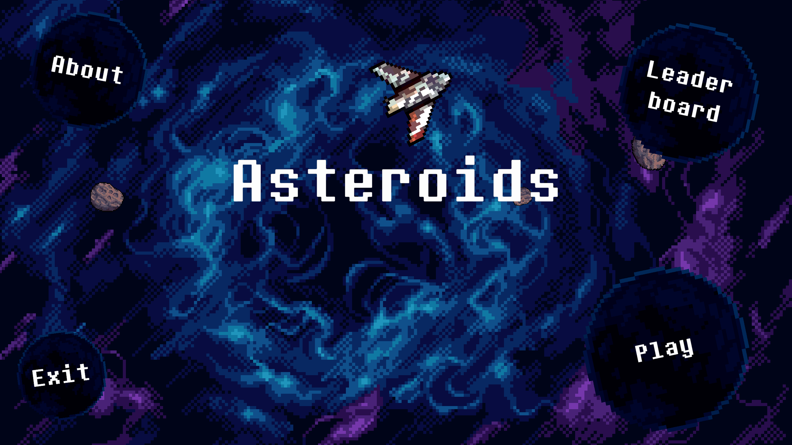
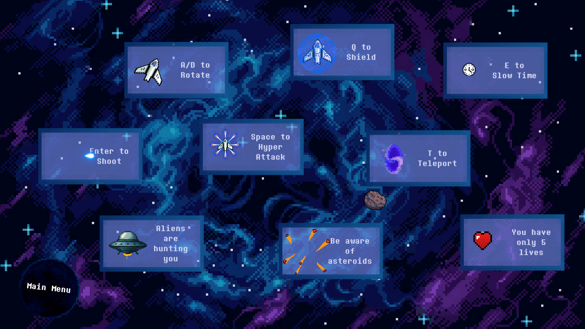
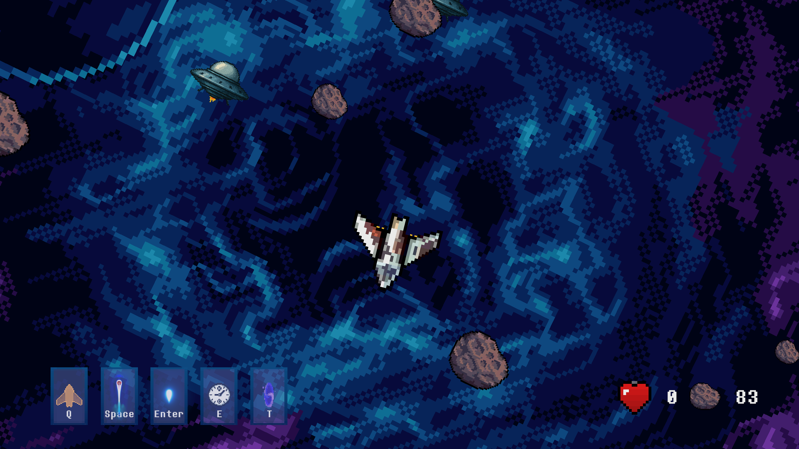
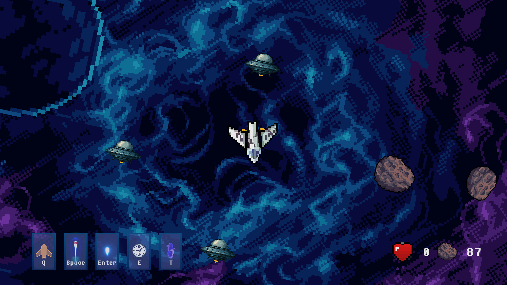
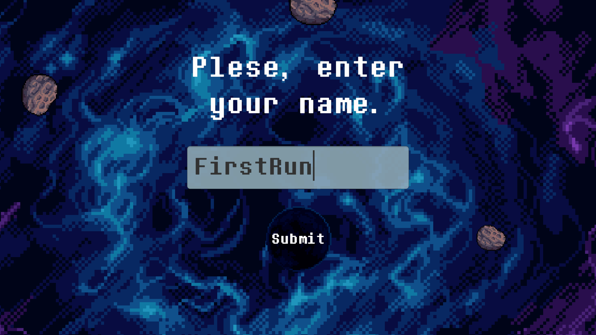
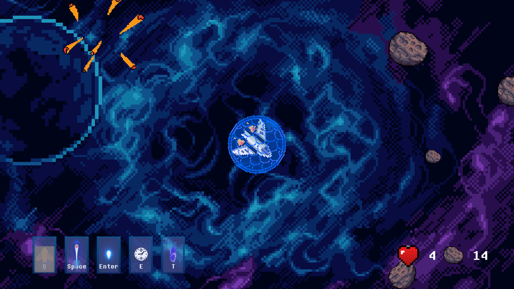
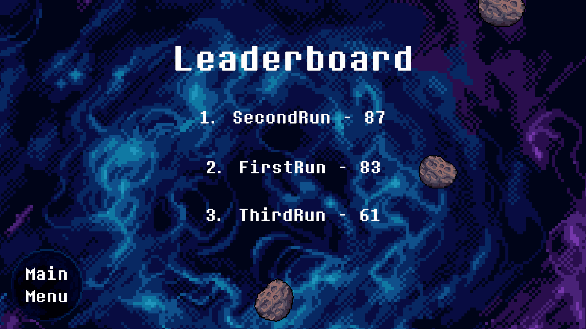
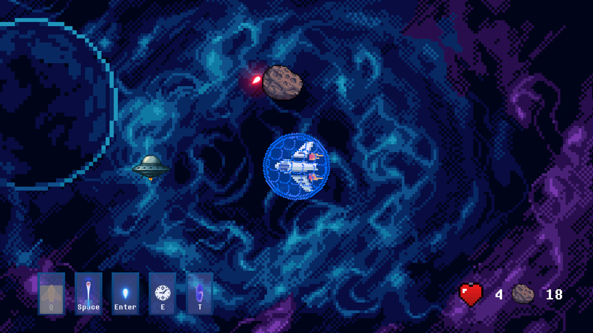
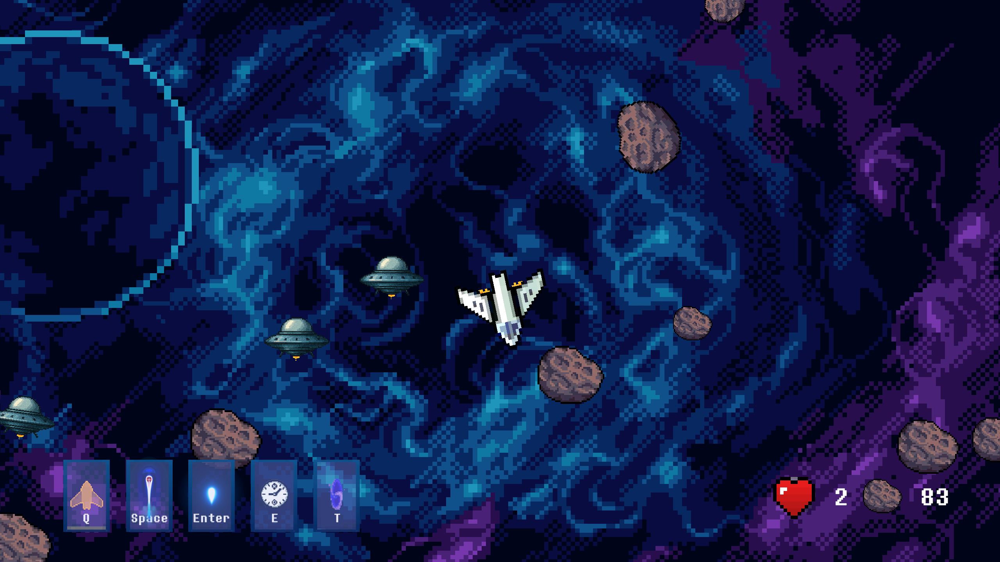

# Asteroids



**Engine**: Unity [Version] 6000.0.46f1

**Pipeline** URP 2D


## Project Overview

Space shooter with mechanics inspired by Asteroids arcade video game.

---

## Folder Structure
```
Assets/
├─ Animations/     # Animation controllers and animations
├─ Fonts/          # Fonts
├─ Prefabs/        # Prefab assets
├─ Scenes/         # Unity scene files
├─ Scripts/        # C# scripts
├─ Settings/       # Key URP settings
├─ Sounds/         # Sound effects and background music
└─ Sprites/        # Image assets for sprites
```

---

## Scenes
| **Scene Name** | **Purpose**                 | **Key Objects**                   |
|----------------|-----------------------------|-----------------------------------|
| MainMenu       | Entry point with UI         | AsteroidSpawner                   |
| Battle         | Actual gameplay             | Spaceship, NavmeshSurface         |
| GameOver       | After player loses          | DamagedSpaceShip                  |
| Leaderboard    | Top 3 players               | LeaderboardLoader                 |
| NameInput      | To input winner's name      | InputField                        |
| About          | Brief description           | FrameWithData                     |
---

## Key Prefabs
### Asteroid
- **Components**:
  - `PolygonCollider2D` (handles collisions)
  - `Animator` (Animations)
  - `Rigidbody2D` (physics)
- **Usage**: Spawned around thee corners of the camera. Serves as an obstacle for the player's space ship.

### AsteroidSpawner
- **Behavior**: Spawns asteroids and UFOs, increases spawning amount during playtime, respawns destroyed and deleted asteroids. UFOs attacks are organized in a form of waves, when one or several UFOs attack Player's spaceship.
- **Customization**: 

    Adjust `Ufo start count` to edit count of UFOs spawned when the game starts.

    Adjust `Ufo wave increment` to edit how much new UFOs are added with every new wave.

    Adjust `Ufo wave delay` to edit time between UFO waves.

    Adjust `Ufo first wave delay` to delay first wave of UFOs.

    Adjust `Asteroid start count` to edit how many asteroids are spawned at the beginning of a battle.

    Adjust `Asteroid increment delay` to delay change in the asteroids count.

    Adjust `Asteroid increment count` to change how many asteroids will be added every time after increment delay.

### AudioManager
- **Usage**: Controls MasterMixer of the whole game. This especially effects fade effect for all sounds on the scene before scene change.
- **Customization**: 

    Adjust `Fade duration` to edit time interval during which volume is decreased from 100% to 0%.

### Button
- **Description**: Simple button with planet texture on the background. 
- **Usage**: After adding it to the scene edit attached script - in this script logic after button click event should be implemented.

---

### Crossfade
- **Description**: Simple scene transition effect. Transition from opace to solid black backgroud at the end of each scene (opposite in the beginning). 
- **Usage**: Checkbox `Is short` changes transition effect's duration.

### FrameWithData
- **Description**: Prefab for creating new elements of `About` menu. 
- **Usage**: Add to the scene, then change sprite, edit text and set up animations for the new sprite.

### Laser
- **Components**:
  - `CapsuleCollider2D` (handles collisions)
  - `AudioSource` (laser sound efect)
  - `Rigidbody2D` (physics)
- **Behavior**: Spawned in the middle of a spaceship when player shoots with a default laser. Flies in the spaceship's nose direction. Destroys asteroid or UFO if collides with them.
- **Customization**: 

    Adjust `Initial force` to change the start force of laser.

    Adjust `Speed` to edit start speed of laser.

### Shield
- **Components**:
  - `CircleCollider2D` (handles collisions)
  - `AudioSource` (shield sound efect)
  - `Rigidbody2D` (physics)
  - `Animator` (keyframes animation)
- **Behavior**: Spawned in the middle of a spaceship to cover it from asteroids and UFO's lasers.

### SpaceShip
- **Components**:
  - `PolygonCollider2D` (handles collisions)
  - `AudioSource` (space ship ambience sound efect)
  - `Rigidbody2D` (physics)
- **Description**: Represents player in game. Is subscribed to the events of player input, handles rotation and all of the available modifiers.
- **Customization**: 

    Adjust `Total lives` to set the number of lives availbale for the player.

    Adjust `Shield delay` to edit how often player can use shield.

    Adjust `Shield duration` to edit how long shield will remain on top of spaceship.

    Adjust `Hyper attack delay` to edit how often player can use hyper attack.

    Adjust `Teleport delay` to edit how often player can use teleport.

    Adjust `Slowdown delay` to edit how often player can slow down time.

    Adjust `Teleportation boundaries` to edit where spaceship can teleport (random positions are selected in this boundaries).

### UFO
- **Components**:
  - `PolygonCollider2D` (handles collisions)
  - `UFOSoundController` (UFO sound efect with logarithmic rolloff)
  - `UFOEngine` (animates flames in the bottom of the UFO)
  - `Rigidbody2D` (physics)
  - `NavMeshAgent` (navigation using NavMesh created for the scene)
- **Description**: Represents player in game. Is subscribed to the events of player input, handles rotation and all of the available modifiers.
- **Customization**: 

    Adjust `Shooting distance` to set the distance at which UFO can shoot.
---

## Key Systems
### 1. Player Movement
- **Description**: Implemented using Unity's New Input System to easily add support for different kinds of devices.
- **Features**:
  - `Enter` is used for shooting.

  - `A/D` are used for rotation.

  - `Q` is used for shield.

  - `Space` is used for hyper attack.

  - `E` is used for time slowdown.

  - `T` is used for teleportation.

### 2. Audio System
- **Description**: Every object with sound effect has AudioSource component attached to it. MainMixer controls all of AudioSources to decrease volume for the smooth scene transitions. 


### 3. Navigation System
- **Description**: UFO's navigation is implemented using NavMeshPlus package. Every UFO is a NavMeshAgent which can move to a certain destination on the scene on a NavMesh baked for the scene. spaceship's teleportation are handles with a help of MavMeshObstacle component attached to independent object which folows ship's movements. This approach was chosen because of continuous NavMesh recalculations when player was rotating a spaceship without splitting up obstacle object and spaceship. 

---

# Screenshots









